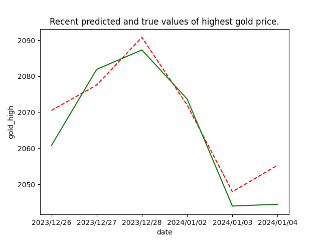

# Project link
https://huggingface.co/spaces/ArtificialCoincidence/Daily_Gold_Highest_Price_Prediction
# ID2223_project
Title: Highest Daily Gold Price Prediction Using Time Series Analysis.

This is a project using open prices of gold, platinum, crude oil US dollar index(USD) and CNN fear and greed index to predict highest price of gold daily.
# Authors
Ruijia Dai, Zahra Khorasani Zavareh
# Introduction
The aim of this project is to predict the daily highest price of gold using historical open prices of various financial indicators, including gold itself, platinum, USD, crude oil, and the CNN fear and greed index. The prediction is achieved through time series analysis and the use of the Prophet forecasting model. The project leverages the Hopsworks platform for data storage, feature engineering, and model deployment.
# Dataset
The dataset consists of historical open prices for gold, platinum, USD, crude oil, and the CNN fear and greed index. The data is collected daily and spans multiple years. The historical prices are obtained from Yahoo Finance and the CNN fear and greed index API. The dataset is stored in Hopsworks feature store, providing a centralized and scalable storage solution for the project.

Data resources: \
Gold price          : https://finance.yahoo.com/quote/GC%3DF?p=GC%3DF \
Platinum price      : https://finance.yahoo.com/quote/PL%3DF?p=PL%3DF \
USD index           : https://finance.yahoo.com/quote/DX-Y.NYB?p=DX-Y.NYB \
Crude oil price     : https://finance.yahoo.com/quote/CL%3DF?p=CL%3DF \
Fear and greed index: https://edition.cnn.com/markets/fear-and-greed
# Methodology
# Data Retrieval and Preprocessing
The project begins with the retrieval of historical data for gold, platinum, USD, crude oil, and the CNN fear and greed index. The data is processed and cleaned to handle missing values and ensure consistency across different indicators. The fear and greed index is reversed to align with the chronological order of other indicators.
# Feature Engineering
The selected features for the model include the open prices of gold, platinum, USD, crude oil, and the fear and greed index. These features, along with the target variable (highest gold price), are integrated into a consolidated dataset. The dataset is sorted by date and prepared for training the forecasting model
# Model Training
The Prophet forecasting model is employed for predicting the highest gold price. The model is configured to include regressors for each feature, capturing the influence of external factors on the target variable. The model is trained using historical data, and the performance is evaluated using a test split.
# Model Deployment
The trained model is saved and deployed using Hopsworks. The model is registered in the model registry, allowing for version control and easy access. The deployment process also includes uploading relevant images and predictions to Hopsworks for monitoring and visualization.
# Huggingface link
https://huggingface.co/spaces/ArtificialCoincidence/Daily_Gold_Highest_Price_Prediction \
User can:
1. See prediction of today's highest gold price (if market opens today and CNN fear and greed value is available)
2. Make prediction of highest gold price with preferred value of open prices
3. See recent predictions and true values of daily highest gold price
# How to Run the Code
To execute the code, follow these steps:
1. Run eda_and_backfill_featuregroup.py
2. Run training_pipeline.py
3. Run feature_inference_training_pipeline_daily.py daily
# Learning algorithm
Facebook Prophet
# Implementation
1. Fetch data of latest 3 years from data resources (eda_and_backfill_featuregroup.py)
2. Select available data and upload to feature group (eda_and_backfill_featuregroup.py)
3. Train model on train dataset and test model on test dataset(5 days' available data latest <=> last 5 rows of data), then save model (training_pipeline.py)
4. Daily: add yesterday's data to feature group (feature_inference_training_pipeline_daily.py)
5. Daily: predict today's highest gold price with saved model (feature_inference_training_pipeline_daily.py)
6. Daily: retrain model on latest data in feature group (feature_inference_training_pipeline_daily.py)
# Result
The project demonstrates promising results in predicting the highest gold price based on historical open prices of various financial indicators. The use of the Prophet model, with careful consideration of relevant features, contributes to accurate predictions. The model's performance is assessed through metrics such as mean absolute error, providing insights into the accuracy of the predictions.
The deployment of the model on Hopsworks enables seamless integration into production environments. The periodic execution of the code, facilitated by Hopsworks scheduling capabilities, ensures regular updates and retraining of the model with new data.

Model evaluation method: MSE(highest gold price true value, highest gold price prediction) \
Recent predictions and true values (prediction: red--, true value: green- -):  \
Automated daily run test: from 2023.12.28 to 2024.01.07 run successfully, can skip insertion and prediction when any necessary data is
unavailable
# Conclusion
The project successfully combines time series analysis, feature engineering, and the Prophet forecasting model to predict the highest gold price based on historical financial indicators. Leveraging Hopsworks provides a robust infrastructure for data storage, feature engineering, model training, and deployment. The results demonstrate the potential for accurate and timely predictions in the domain of financial forecasting.
